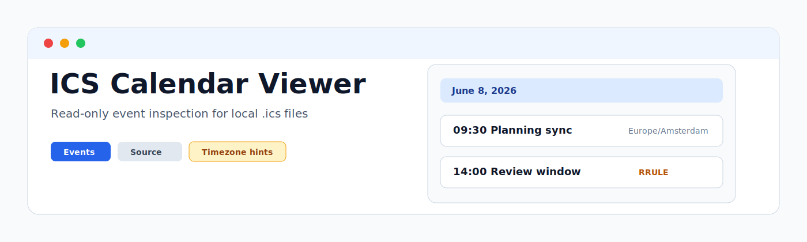
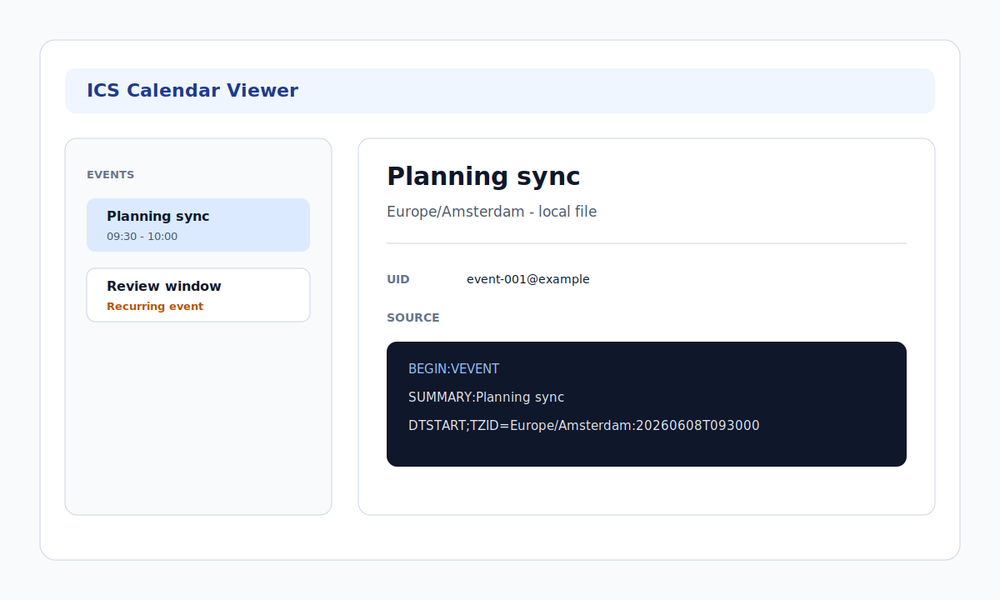

<p align="center">
  
</p>

<p align="center">
  <a href="https://github.com/viggomeesters/obsidian-ics-calendar-viewer/releases/latest"></a>
  <a href="LICENSE"></a>
  
  
</p>

# ICS Calendar Viewer

ICS Calendar Viewer is a read-only Obsidian viewer for local `.ics` files. It opens calendar files as an inspection surface with component summaries, grouped event lists, filters, event details, recurrence and timezone warnings, and a raw source fallback.



## Scope

- Registers `.ics` files with the `ics-calendar-viewer` view.
- Parses local `VCALENDAR`, `VEVENT`, `VTODO`, and `VTIMEZONE` data.
- Shows event and task lists grouped by date or component type.
- Shows details for summary, description, location, organizer, attendees, start/end, timezone, UID, status, recurrence, and source lines.
- Provides text and date filters for summary, location, attendee, UID, and date range.
- Keeps large files bounded with parse/render caps.
- Never syncs calendars, fetches remote URLs, imports to daily notes, generates event notes, sends RSVP, or writes back to `.ics` files.

## Non-goals

This plugin is not a calendar sync plugin, CalDAV client, daily note importer, note generator, attendee mailer, RSVP client, notification service, or drag/drop planning calendar. It does not use network APIs, clipboard APIs, `eval`, `new Function`, or process APIs in plugin runtime code.

## Related Community Plugins

- ICS imports events from calendar/ICS URLs into Daily Notes.
- Full Calendar provides a full calendar UI with read-only ICS/CalDAV remote calendars.
- MemoChron focuses on calendar integration and event notes.
- iCal generates iCal from vault tasks.

ICS Calendar Viewer deliberately stays file-inspection first: open a local `.ics`, inspect what is inside, and fall back to raw source when parsing is limited.

## Development

```bash
npm install
npm run build
npx tsc --noEmit
npm test
```
